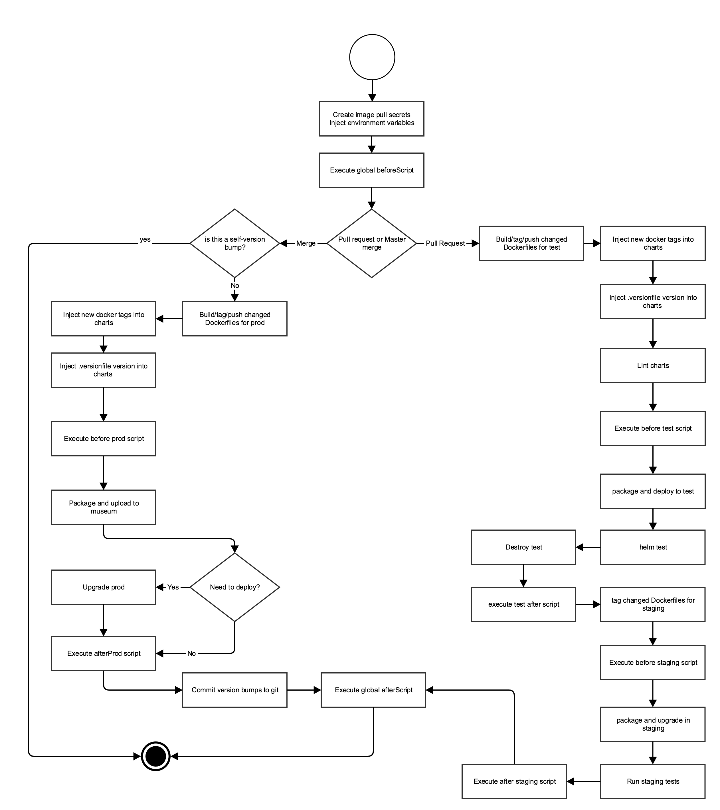

# Table of Contents

<!-- MarkdownTOC levels="1,2,3,4,5,6" autolink=true bracket="round" -->

- [Quick start](#quick-start)
  - [Complete example](#complete-example)
  - [Create a github repository](#create-a-github-repository)
  - [Edit the values.yaml file](#edit-the-valuesyaml-file)
  - [Edit pipeline.yaml](#edit-pipelineyaml)
  - [Edit .versionfile](#edit-versionfile)
  - [Edit your Dockerfile](#edit-your-dockerfile)
  - [Add job configuration](#add-job-configuration)
  - [Bonus: Add job status badge to your readme](#bonus-add-job-status-badge-to-your-readme)
- [Conversion from solas](#conversion-from-solas)
- [CNCT shared workflow library](#cnct-shared-workflow-library)
  - [Jenkins Helm chart](#jenkins-helm-chart)
  - [Job configurations](#job-configurations)
  - [Shared workflow library defaults](#shared-workflow-library-defaults)
  - [Shared workflow library code](#shared-workflow-library-code)
  - [Helm chart GitHub repositories](#helm-chart-github-repositories)
  - [Repository structure:](#repository-structure)
    - [.versionfile](#versionfile)
    - [pipeline.yaml](#pipelineyaml)
      - [type](#type)
      - [beforeScript](#beforescript)
      - [afterScript](#afterscript)
      - [envValues](#envvalues)
      - [helmRepos](#helmrepos)
      - [slack](#slack)
      - [vault](#vault)
      - [helm](#helm)
      - [pullSecrets](#pullsecrets)
      - [rootfs / builds](#rootfs--builds)
      - [configs / deployments](#configs--deployments)
      - [test](#test)
      - [stage](#stage)
      - [prod](#prod)
    - [Pipeline yaml example](#pipeline-yaml-example)
  - [User scripts](#user-scripts)
    - [Environment variables](#environment-variables)
  - [cert-manager and TLS support](#cert-manager-and-tls-support)
  - [Pipeline flow](#pipeline-flow)
  - [Common problems](#common-problems)
    - [Problems with chart labels](#problems-with-chart-labels)

<!-- /MarkdownTOC -->

# Quick start

## Complete example

Full example at [pipeline-demo repository](https://github.com/samsung-cnct/pipeline-demo)

## Create a github repository

Create a Github repository with the following folder structure, substituting your own names for things like `MY-CHART-NAME` and `MY-CHART-IMAGE` 

```
.
├── .versionfile
├── README.md
├── charts
│   └── MY-CHART-NAME
│       ├── .helmignore
│       ├── Chart.yaml
│       ├── templates
│       │   └── chart templates here
│       └── values.yaml
├── pipeline.yaml
├── rootfs
│   └── MY-CHART-IMAGE
│       └── Dockerfile
└── src
    └── helloWorld.go
```

or 

```
.
├── .versionfile
├── README.md
├── deployments
│   └── MY-CHART-NAME
│       ├── .helmignore
│       ├── Chart.yaml
│       ├── templates
│       │   └── chart templates here
│       └── values.yaml
├── pipeline.yaml
├── build
│   └── MY-CHART-IMAGE
│       └── Dockerfile
└── src
    └── helloWorld.go
```

or 

```
.
├── .versionfile
├── README.md
├── deployments
│   └── helm
│       └── MY-CHART-NAME
│           ├── .helmignore
│           ├── Chart.yaml
│           ├── templates
│           │   └── chart templates here
│           └── values.yaml
├── pipeline.yaml
├── build
│   └── MY-CHART-IMAGE
│       └── Dockerfile
└── src
    └── helloWorld.go
```

or 

```
.
├── .versionfile
├── README.md
├── deployments
│   └── helm
│       └── MY-CHART-NAME
│           ├── .helmignore
│           ├── Chart.yaml
│           ├── templates
│           │   └── chart templates here
│           └── values.yaml
├── pipeline.yaml
├── build
│   └── docker
│       └── MY-CHART-IMAGE
│           └── Dockerfile
└── src
    └── helloWorld.go
```

## Edit the values.yaml file

Edit the `values.yaml` for your chart, to make sure it is compatible with how the pipeline treats chart docker images.  
Make sure that your `values.yaml` specifies source docker images form pods as single value - not separating image and tag:

```
replicas: 1
service:
  name: my-service
images:
  myMainImage: quay.io/samsung_cnct/MY-CHART-IMAGE:0.0.5
```

## Edit pipeline.yaml 

Edit the `pipeline.yaml` file:

```
type: chart
rootfs:                                   # image building configuration
 - image: samsung_cnct/MY-CHART-IMAGE     # do not include 'quay.io' part
   context: MY-CHART-IMAGE                # folder name under rootfs (or build) folder
   dockerContext: .                       # docker build context, relative to root of github repository
   chart: MY-CHART-NAME                   # name of the chart in Chart.yaml
   tagValue: images.myMainImageTag        # Optional yaml path to docker image tag in values.yaml of MY-CHART-NAME chart
configs:                                  # chart building configuration
 - chart: MY-CHART-NAME                   # name of the chart in Chart.yaml
   timeout: 600                           # timeout values for things like running Helm tests
   retries: 1                             # number of retries for things like Helm tests
   release: MY-RELEASE-NAME               # name of Helm release
prod:                                     # prod environment options
 doDeploy: auto                           # deploy to prod ever time something is merged into 'master' branch
``` 

## Edit .versionfile

Add a `Major.Minor.Build` string to `.versionfile`:

```
0.1.0
```

## Edit your Dockerfile

Fill out the `Dockerfile` with steps to build your binary

```
FROM golang
LABEL authors="YOUR NAME<YOUR@EMAIL>"

RUN ls

# we set dockerContext to '.', so we can copy from 'src' relative to our github repo root
COPY src/helloWorld.go /helloWorld.go
RUN go build helloWorld.go

CMD helloWorld
```

Commit all the changes to your repository

## Add job configuration

Create and merge a pull request with your github repository configuration to [CNCT job configuration repo](https://github.com/samsung-cnct/pipeline-jobs)  
Add the following under `configs`:

```
---
type: cnct
uniqueId: pipeline-MY-CHART-NAME
displayName: pipeline-MY-CHART-NAME
description: MY-CHART-DESCRIPTION 
apiUrl: "https://api.github.com"
org: samsung-cnct
repo: MY-GITHUB-REPOSITORY-NAME
keepDays: 10
credentials: github-access
```

## Bonus: Add job status badge to your readme

Add the jenkins job badge to your repo README.md:

```
[](https://jenkins.cnct.io/job/pipeline-MY-CHART-NAME/job/master)
```

# Conversion from solas

* Add a config for your gihub repository to `https://github.com/samsung-cnct/pipeline-jobs/tree/master/configs` and create a PR.
* Make sure `Chart.yaml` is not in your `.gitignore` file
* Create `rootfs/your-docker-image-name` and `charts/your-chart-name` folders in the rootof your git repo
* Move all the chart files from `/your-chart-name` to `charts/your-chart-name`
* Move `/build/Chart.yaml.in` to `charts/your-chart-name/Chart.yaml` or `deployments/your-chart-name/Chart.yaml` or `deployments/helm/your-chart-name/Chart.yaml`
* Add a real chart version to `charts/your-chart-name/Chart.yaml`. Actual version number doesn't matter too much as you will set the base version in `.versionfile`
* Move the `Dockerfile` and whatever otherfiles the docker build context will need from `github.com/samsung-cnct/your-project-container` to `rootfs/your-docker-image-name/` or `build/your-docker-image-name/`
* Create `.versionfile` in the root of your repository. Put a real base version number in the file in `Major.Minor.Build` format.
* Make sure chart templates don't use `.Chart.Version` directly (see [Problems with chart labels](#problems-with-chart-labels))
* Create `pipeline.yaml` file in the root of your repository. 
* Fill out `pipeline.yaml`

The important sections are:

```
type: chart
builds:                                 # 'rootfs' is equivalent to 'builds'
  - image: samsung-cnct/my-image        # docker image name. DO NOT include the registry name (quay.io part)
    context: your-docker-image-name     # folder containing the Dockerfile under ./rootfs
    chart: your-chart-name              # folder containing the chart files under ./charts
    value: images.myimage               # EITHER: YAML path to the value referring to docker image name in your-chart-name values.yaml, with complete with tag
    tagValue: images.mytag              # OR: YAML path to the value referring to docker image tag only in your-chart-name values.yaml
deployments:                            # 'configs' is equivalent to 'deployments'
  - chart: your-chart-name              # folder containing the chart files under ./charts 
    release: your-helm-release-name     # name of the helm release for your-chart-name
    test: 
      values:
        - key: config.other             # YAML path to the value referring to the value you want to override
          value: override-value         # value to override with
    stage: 
      values:
    ...
    prod:
      values:
prod:
  doDeploy: versionfile                 # set to 'versionfile' to deploy to prod when .versionfile changes. Set to 'auto' to continously deploy on every merged change. Set to 'none' to never deploy to prod
```

YAML path is simply a dot-path to a yaml value. For the following snippet:


```
service: mychart
images:
  myimage: quay.io/samsung-cnct/my-image:1.1.1
  pullPolicy: Always
config:
  other: value
```

YAML path to `myimage` is `images.myimage`. YAML path to `other` is `config.other`.

Value overrides translate to `--set` directives to `helm install` and `helm upgrade`. For the following snippet:

```
values:
  - key: config.other 
    value: override-value
```

pipeline will run `helm install ... --set config.other='override-value'`

# CNCT shared workflow library

The [shared workflow library](https://jenkins.io/doc/book/pipeline/shared-libraries/) in this repository is a library of reusable Groovy code, that is reused my multiple jenkins jobs/pipelines in order to test, build and deploy Kubernetes Helm chartds. A full CNCT pipeline consists of:

* Jenkins Helm chart
* Job configuration files written in the Groovy language, stored in a separate org-specific git repo.
* Shared workflow library defaults
* Shared workflow library code
* Helm chart GitHub repositories

Individual chart pipelines are configured through required `pipeline.yaml` and `.versionfile` files

## Jenkins Helm chart

Helm chart that deploys Jenkins CI, optionally configuring CNCT shared workflow library as a [global shared library](https://jenkins.io/doc/book/pipeline/shared-libraries/#global-shared-libraries)

See https://github.com/samsung-cnct/pipeline-jenkins for an example setup 

## Job configurations

All pipeline configuration files are described in below sections in detail. *They live in a separate, organization-specific repository.* 

There is no particular convention enforced on the job configurations by the library, as long as Jenkins jobs generated by the configurations refer to, and execute the pipeline library:

```
@Library('pipeline')
import import io.cnct.pipeline.*
new cnctPipeline().execute()
```

See https://github.com/samsung-cnct/pipeline-jobs for an example setup

## Shared workflow library defaults

Defaults are located in the [resources](resources/io/cnct/pipeline/defaults.yaml) folder.

These specify default values for pipeline runs. Some of the values can only be specified in the defaults file, some can be overwritten by the individual repository configurations.

Setting | Description
| :--- | :---: |
`jenkinsNamespace` | Kubernetes namespace of Jenkins agent pods 
`prodNamespace` | 'Production' kubernetes namespace
`stageNamespace` | 'Staging' kubernetes namespace
`serviceAccount` | Jenkins Kubernetes service account
`doDeploy` | Deploy to prod on merge: `none` never; `versionfile` when version file changes; `auto` always
`retries` | Number of retries on deploys and tests
`timeout` | Helm timeout
`versionfile` | Name of a version file required for every pipeline application repository
`shell` | Default shell for script execution
`slack.channel` | Default notification channel
`slack.credentials` | Jenkins slack credentials id
`slack.domain` | Slack team domain 
`image.dind` | Default image for docker-in-docker container
`image.docker` | Default image for docker client container
`image.helm` | Default image for helm client container
`image.vault` | Default image for vault client container
`image.script` | Default image for script container
`vault.server`| Vault server URL
`vault.credentials` | Id of hashicorp vault token credentials from Jenkins deployment
`vault.api` | Vault API version
`helm.namespace` | Tiller namespace
`helm.registry` | URL of chart museum API
`docker.registry` | Docker registry to use
`docker.credentials` | Id of docker registry username and password credentials from Jenkins deployment
`docker.testTag` | Additonal tag for test stage images
`docker.stageTag` | Additonal tag for staging stage images 
`docker.prodTag` | Additonal tag for prod stage images
`packages` | Supported locations for dockerfile subfolders, relative to workspace root
`deployments` | Supported locations for chart subfolders, relative to workspace root
`tls.prodIssuer` | Optional name of cert-manager ClusterIssuer for prod
`tls.stagingIssuer` | Optional name of cert-manager ClusterIssuer for staging
`tls.stagingIssuer` | Optional name of cert-manager ClusterIssuer for staging
`targets.testCluster` | Path to vault secret containing kube config for test target cluster
`targets.stagingCluster` | Path to vault secret containing kube config for staging target cluster
`targets.prodCluster` | Path to vault secret containing kube config for prod target cluster
`cveScan.maxCve` | Number of vulnerabilities allowed to be present in container
`cveScan.maxLevel` | Level [Unknown Negligible Low Medium High Critical Defcon1] of `cveScan.maxCve`
`cveScan.ignore` | True to pass CI even if `cveScan.maxCve` surpassed, False to to CI if `cveScan.maxCve` surpassed
`ciSkip` | Arbitrary string for commits of version bump updates to github by Jenkins
`github.credentials` | ID of jenkins username/password credentials with github push access
`github.pushUser` | Arbitrary name of git user for `git config`
`github.pushEmail`| Arbitrary email of user for `git config`
Example:

```
jenkinsNamespace: pipeline-tools
prodNamespace: prod
stageNamespace: staging
serviceAccount: jenkins
doDeploy: none
retries: 1
timeout: 600
versionfile: .versionfile
shell: sh
slack:
  channel: #estore-demo
  credentials: slack-access
  domain: "samsung-cnct"
images: 
  dind: docker:stable-dind
  docker: docker:stable
  helm: quay.io/maratoid/helm:latest
  vault: quay.io/maratoid/vault:latest
  script: quay.io/maratoid/script:latest
ciSkip: "SKIP_DUE_TO_CI_SELF_COMMIT"
github:
  credentials: github-access
  pushUser: jenkins
  pushEmail: jenkins@cnct.io
vault:
  server: http://vault-access.pipeline-tools.svc.cluster.local
  credentials: vault-plugin
  api: v1
  tls:
    secret: "vault-client-tls"
    cert: "vault-client.pem"
    key: "vault-client-key.pem"
    ca: "ca.pem"
helm:
  namespace: kube-system
  registry: charts.cnct.io
docker:
  registry: quay.io
  credentials: docker-creds
  testTag: test
  stageTag: staging
  prodTag: prod
tls:
  prodIssuer: prod-issuer
  stagingIssuer: staging-issuer
targets: 
  prodCluster: secret/prod-cluster/config
  stagingCluster: secret/staging-cluster/config
  testCluster: secret/test-cluster/config
packages:
  - rootfs
  - build
  - build/docker
deployments:
  - charts
  - deployments
  - deployments/helm
cveScan:
  maxCve: 0
  maxLevel: Critical
  ignore: False
```

## Shared workflow library code

Workflow library code is a set of groovy classes located under [src/io/cnct/pipeline](src/io/cnct/pipeline)  
Individual repository `Jenkinsfile`s can reference it either by setting up a global shared workflow under Jenkins, or 
importing the library individually and starting it via 

```
@Library('pipeline')
import import io.cnct.pipeline.*
new cnctPipeline().execute()
```

## Helm chart GitHub repositories

Helm chart github repositories are the individual Helm charts built byt the pipeline library. Library imposes some requirements on the repositories it is targeted at:

## Repository structure:

Example:

```
repository root
  charts
    chart-name
      chart contents
    chart-name
      chart-contents
  rootfs
    fs-contents-folder
      Dockerfile
    fs-contents-folder
      Dockerfile
  pipeline.yaml
  .versionfile
```

Neither `charts` nor `rootfs` are required. I.e. you can have a repository that builds charts but not docker images, only docker images or both charts and docker images. All charts under `charts` and all docker images under `rootfs` will be versioned using .versionfile contents.

### .versionfile

Actual name is configurable via shared workflow library defaults. Required.  
Contents are:

```
Major.Minor.Build
```

For example:

```
1.1.2
```

Contents serve as a component or both docker tags and full [SemVer](https://semver.org/) version number for built charts.


### pipeline.yaml

Cofiguration for each individual pipeline.  


#### type

Type of pipeline. Currently only `chart` is supported

Setting | Description
| :--- | :---: |
`type` | Type of pipeline

#### beforeScript

Global 'Before' script to be executed. Executed after environment variable injection and pull secret creation.

Setting | Description
| :--- | :---: |
`beforeScript.image` | docker image to use.
`beforeScript.script` | path to script file to run relative to current workspace
`beforeScript.shell` | Which shell to use for execution

#### afterScript

Global 'After' script to be executed. Executed after everything else in the pipeline finished.

Setting | Description
| :--- | :---: |
`afterScript.image` | docker image to use.
`afterScript.script` | path to script file to run relative to current workspace
`afterScript.shell` | Which shell to use for execution

#### envValues

Environment values to be injected. Can be straight values, or references to a value from Vault K/V.

Setting | Description
| :--- | :---: |
`envValues` | Array of environment variable definitions
`envValues.[].envVar` | Variable name
`envValues.[].value` | Variable value
`envValues.[].secret` | Path to Vault K/V value. I.e `kv-backend/kv-name/kv-value-name`
`envValues.[].env` | Name of Jenkins environment variable to take value from. Environment variables from [git plugin](https://wiki.jenkins.io/display/JENKINS/Git+Plugin) and [Jenkins](https://wiki.jenkins.io/display/JENKINS/Building+a+software+project#Buildingasoftwareproject-belowJenkinsSetEnvironmentVariables) are supported

#### helmRepos

Helm repositories for requirements. `pipeline` is a reserved name and should not be used

Setting | Description
| :--- | :---: |
`helmRepos` | Array of helm repository definitions
`helmRepos.[].name` | Repository local name, e.g. `incubator`
`helmRepos.[].url` | Repository URL, e.g. `https://kubernetes-charts-incubator.storage.googleapis.com`

#### slack

Slack notification info.

Setting | Description
| :--- | :---: |
`slack.channel` | channel for notifications

#### vault

Vault server information

Setting | Description
| :--- | :---: |
`vault.server` | Vault server URL
`vault.credentials` | Jenkins vault token credential ID

#### helm

Helm namespace information

Setting | Description
| :--- | :---: |
`helm.namespace` | Tiller namespace

#### pullSecrets

Kubernetes image pull secrets to create, in case some of the docker images used in the pipeline building process are in private repositories. Do not apply to the image BEING built, just images used FOR BUILDING.

Setting | Description
| :--- | :---: |
`pullSecrets` | Array of pull secret objects
`pullSecrets.[].name` | pull secret name
`pullSecrets.[].server` | Registry server
`pullSecrets.[].username` | Registry user name
`pullSecrets.[].email` | Registry email
`pullSecrets.[].password` | Path to Vault K/V value containing registry password. I.e `kv-backend/kv-name/kv-value-name`


#### rootfs / builds

Array of images and binaries to be built under `rootfs` folder, and how they relate to Helm values of charts under `charts`

Setting | Description
| :--- | :---: |
`rootfs` | Array of rootfs objects
`builds` | Equivalent to `rootfs`
`rootfs.[].image` | image to build, without the `:tag`, or image to use for building a binary
`rootfs.[].script` |  Path to script to run in `rootfs.[].image` relative to current workspace. Mutually exclusive with `buildArgs`, `context`, `dockerContext`, `chart`, `value` and `tagValue`
`rootfs.[].commands` | commands to run in `rootfs.[].image` (multi line string). Mutually exclusive with `buildArgs`, `context`, `dockerContext`, `chart`, `value`  and `tagValue`
`rootfs.[].buildArgs` | Array of build arg objects for the image
`rootfs.[].buildArgs.[].arg` | arg name
`rootfs.[].buildArgs.[].value` | arg value
`rootfs.[].buildArgs.[].secret` | Path to Vault K/V value. I.e `kv-backend/kv-name/kv-value-name`
`rootfs.[].buildArgs.[].env` | Name of Jenkins environment variable to take value from. Environment variables from [git plugin](https://wiki.jenkins.io/display/JENKINS/Git+Plugin) and [Jenkins](https://wiki.jenkins.io/display/JENKINS/Building+a+software+project#Buildingasoftwareproject-belowJenkinsSetEnvironmentVariables) are supported
`rootfs.[].context` | Path, relative to `current workspace/rootfs`, to which rootfs contains the docker file for this image. I.e. specifying `myimage` will look for `Dockerfile` under `/jenkins/workspace/rootfs/myimage`
`rootfs.[].dockerContext` | Path relative to current `current workspace` that will serve as docker build context. I.e. specifying `.` will result in `docker build . -f /jenkins/workspace/rootfs/rootfs.[].context/Dockerfile`
`rootfs.[].chart` | Name of the chart using this image, under `charts`
`rootfs.[].value` | Dot-path to value under the chart's values.yaml that sets this image with tag for the chart. I.e. `section.image.myawesomecontainer`. Mutually exclusive with `tagValue`
`rootfs.[].tagValue` | Dot-path to tag value under the chart's values.yaml that sets this image tag only for the chart. I.e. `section.image.myTag`. Mutually exclusive with `value`
`rootfs.[].locationOverride` | Per-image override for default dockerfile locations in [defaults.packages](#shared-workflow-library-defaults), relative to repository root. I.e. specifying `cmd` will result in `docker build . -f /jenkins/workspace/rootfs.[].locationOverride/rootfs.[].context/Dockerfile`

#### configs / deployments

Pipeline stage configurations

Setting | Description
| :--- | :---: |
`configs` | Array of pipeline stage configurations objects
`deployments` | Equivalent to `configs`
`configs.[].chart` | Chart name under `charts`
`configs.[].setAppVersion` | update `appVersion` to match `version` in Chart.yaml. False by default
`configs.[].timeout` | Helm timeout for things like helm tests
`configs.[].retries` | Humber of retries for things like helm tests
`configs.[].release` | Helm prod release name
`configs.[].test.values` | Array of override values for test stage. Can be straight values, or references to a value from Vault K/V.
`configs.[].test.values.[].key` | Name of helm value. I.e. `some.key.somewhere`
`configs.[].test.values.[].value` | Value to use
`configs.[].test.values.[].secret` | Path to Vault K/V value containing the value. I.e `kv-backend/kv-name/kv-value-name`
`configs.[].stage.values` | Array of override values for staging stage. Can be straight values, or references to a value from Vault K/V.
`configs.[].stage.values.[].key` | Name of helm value. I.e. `some.key.somewhere`
`configs.[].stage.values.[].value` | Value to use
`configs.[].stage.values.[].secret` | Path to Vault K/V value containing the value. I.e `kv-backend/kv-name/kv-value-name`
`configs.[].stage.tests` | Array of test scripts to run as part of staging tests
`configs.[].stage.tests.[].image` | Docker image to use
`configs.[].stage.tests.[].shell` | Shell to use for running the script or commands
`configs.[].stage.tests.[].script` | Path to script file to run relative to current workspace
`configs.[].stage.tests.[].commands` | Commands to run (multi line string)
`configs.[].prod.values` | Array of override values for prod stage. Can be straight values, or references to a value from Vault K/V.
`configs.[].prod.values.[].key` | Name of helm value. I.e. `some.key.somewhere`
`configs.[].prod.values.[].value` | Value to use
`configs.[].prod.values.[].secret` | Path to Vault K/V value containing the value. I.e `kv-backend/kv-name/kv-value-name`

#### test 

Addtitional test stage actions

Setting | Description
| :--- | :---: |
`test.beforeScript` | Script info to execute before test deployment
`test.beforeScript.image` | Docker image to use for running the script
`test.beforeScript.shell`| Shell to use for running the script
`test.beforeScript.script` | Path to script file to run relative to current workspace
`test.beforeScript.commands` | Commands to run (multi line string)
`test.afterScript` | Script info to execute after test namespace is destroyed
`test.afterScript.image` | Docker image to use for running the script
`test.afterScript.shell` | Shell to use for running the script
`test.afterScript.script` | Path to script file to run relative to current workspace
`test.afterScript.commands` | Commands to run (multi line string)
`test.cluster` | Path to vault secret containing kube config for test target cluster

#### stage 

Addtitional staging stage actions

Setting | Description
| :--- | :---: |
`stage.beforeScript` | Script info to execute before staging deployment
`stage.beforeScript.image` | Docker image to use for running the script
`stage.beforeScript.shell` | Shell to use for running the script
`stage.beforeScript.script` | Path to script file to run relative to current workspace
`stage.beforeScript.commands` | Commands to run (multi line string)
`stage.afterScript` | Script info to execute afrter staging deployment
`stage.afterScript.image` | Docker image to use for running the script
`stage.afterScript.shell` | Shell to use for running the script
`stage.afterScript.script` | Path to script file to run relative to current workspace
`stage.afterScript.commands` | Commands to run (multi line string)
`stage.deploy` | deploy to stage, true or false. False by default
`stage.cluster` | Path to vault secret containing kube config for stage target cluster
`stage.namespace` | Name of staging namespace. Defaults to value of `defaults.stageNamespace`

#### prod 

Addtitional prod stage actions

Setting | Description
| :--- | :---: |
`prod.beforeScript` | Script info to execute before prod deployment
`prod.beforeScript.image` | Docker image to use for running the script
`prod.beforeScript.shell` | Shell to use for running the script
`prod.beforeScript.script` | Path to script file to run relative to current workspace
`prod.beforeScript.commands` | Commands to run (multi line string)
`prod.afterScript` | Script info to execute before prod deployment
`prod.afterScript.image` | Docker image to use for running the script
`prod.afterScript.shell` | Shell to use for running the script
`prod.afterScript.script` | Path to script file to run relative to current workspace
`prod.afterScript.commands` | Commands to run (multi line string)
`prod.doDeploy` | Perform prod deployment condition. `none` - never. `versionfile` - only if versionfile changed. `auto` - always
`prod.cluster` | Path to vault secret containing kube config for prod target cluster
`prod.namespace` | Name of prod namespace. Defaults to value of `defaults.prodNamespace`

### Pipeline yaml example

Below example was specifically written to use most features of the pipeline configuration:

```
type: chart
beforeScript:
  script: scripts/globalBefore.sh
afterScript:
  image: alpine:latest
  script: scripts/globalAfter.sh
pullSecrets:
  - name: quay
    server: quay.io
    username: maratoid
    email: maratoid@gmail.com
    password: secret/pull/quay
envValues:
  - envVar: BUSYBOX_SECRET_VARIABLE
    secret: jobs/demo/demovalue
  - envVar: BUSYBOX_PLAIN_VARIABLE
    value: THIS-IS-A-DUMMY-PLAIN-VAR-FOR-TESTING
  - envVar: GIT_COMMIT
    env: GIT_COMMIT
  - envVar: JOB_NAME
    env: JOB_NAME
helmRepos:
  - name: incubator
    url: https://kubernetes-charts-incubator.storage.googleapis.com
builds:
  - image: bash:4.4.23
    script: scripts/generatefile.sh
    shell: /bin/bash
  - image: bash:4.4.23
    commands: |
      echo "echo \"test from inline: running in ${PIPELINE_WORKSPACE}\" > testfrominline.sh
    shell: /bin/bash
  - image: maratoid/pipeline-demo
    buildArgs: 
      - arg: GIT_COMMIT
        env: GIT_COMMIT
      - arg: JOB_NAME
        env: JOB_NAME
      - arg: SECRET_ARG
        secret: jobs/demo/demovalue
    context: pipeline-demo
    dockerContext: .
    chart: pipeline-demo
    tagValue: images.imageTag
deployments:
  - chart: pipeline-demo
    timeout: 600
    retries: 2
    release: pipeline-demo
    test: 
      values:
        - key: pipeline.secretval
          secret: jobs/demo/nested/test
        - key: pipeline.plainval
          value: THIS-IS-A-DUMMY-PLAIN-VAR-FOR-TESTING
    stage: 
      values:
        - key: pipeline.secretval
          secret: jobs/demo/nested/stage
        - key: pipeline.plainval
          value: THIS-IS-A-DUMMY-PLAIN-VAR-FOR-TESTING
        - key: ingress.staging.name
          value: pipelinedemo-staging-ingress
        - key: ingress.staging.host
          value: pipelinedemo.staging.cnct.io
        - key: ingress.staging.secret
          value: pipelinedemo-staging-secret
        - key: ingress.staging.path
          value: /
      tests:
        - image: bash:4.4.23
          script: scripts/stageTest.sh
        - image: quay.io/maratoid/helm:latest
          commands: |
            echo "Testing KUBECONFIG (${KUBECONFIG}) injection:" 
            kubectl version
            kubectl get po -n pipeline-tools
    prod: 
      values:
        - key: pipeline.secretval
          secret: jobs/demo/nested/prod
        - key: pipeline.plainval
          value: THIS-IS-A-DUMMY-PLAIN-VAR-FOR-TESTING
        - key: ingress.prod.name
          value: pipelinedemo-prod-ingress
        - key: ingress.prod.host
          value: pipelinedemo.prod.cnct.io
        - key: ingress.prod.secret
          value: pipelinedemo-prod-secret
        - key: ingress.prod.path
          value: /
        - key: ingress.friendly.name
          value: pipelinedemo-friendly-ingress
        - key: ingress.friendly.host
          value: pipelinealt.cnct.io
        - key: ingress.friendly.secret
          value: pipelinedemo-friendly-secret
        - key: ingress.friendly.path
          value: /
tls:
  staging:
    - name: pipelinedemo-staging-cert
      secretName: pipelinedemo-staging-secret
      dnsName: pipelinedemo.staging.cnct.io
  prod:
    - name: pipelinedemo-prod-cert
      secretName: pipelinedemo-prod-secret
      dnsName: pipelinedemo.prod.cnct.io
    - name: pipelinedemo-friendly-cert
      secretName: pipelinedemo-friendly-secret
      dnsName: pipelinealt.cnct.io
test:
  cluster: secret/test-cluster/config
  beforeScript:
    script: scripts/testBefore.sh
    shell: /bin/bash
  afterScript:
    image: alpine:latest
    script: scripts/testAfter.sh
stage:
  namespace: staging
  cluster: secret/staging-cluster/config
  deploy: true
  beforeScript:
    script: scripts/stageBefore.sh
    shell: /bin/bash
  afterScript:
    image: alpine:latest
    commands: |
      echo "THIS IS STAGE AFTER SCRIPT EXECUTING"
      echo "INJECTED VARS"
      echo "BUSYBOX_SECRET_VARIABLE is $BUSYBOX_SECRET_VARIABLE"
      echo "BUSYBOX_PLAIN_VARIABLE is $BUSYBOX_PLAIN_VARIABLE"

      echo "PIPELINE VARIABLES"
      echo "PIPELINE_PROD_NAMESPACE is $PIPELINE_PROD_NAMESPACE"
      echo "PIPELINE_STAGE_NAMESPACE is $PIPELINE_STAGE_NAMESPACE"
      echo "PIPELINE_BUILD_ID is $PIPELINE_BUILD_ID"
      echo "PIPELINE_JOB_NAME is $PIPELINE_JOB_NAME"
      echo "PIPELINE_BUILD_NUMBER is $PIPELINE_BUILD_NUMBER"
      echo "PIPELINE_WORKSPACE is $PIPELINE_WORKSPACE"   
prod: 
  namespace: prod
  cluster: secret/prod-cluster/config
  beforeScript:
    script: scripts/prodBefore.sh
    shell: /bin/bash
  afterScript:
    image: alpine:latest
    script: scripts/prodAfter.sh 
  doDeploy: auto
```

## User scripts

Pipeline will preserve user script containers with the same image name for the lifetime of pipeline run.
I.e. if you use `quay.io/myimage` for your global `beforeScript` and end up installing `kubectl` as a part of the script run,
`kubectl` will still be available in the `afterScript` proivided you used the same `quay.io/myimage` image.

### Environment variables

The following environment variables are injected into all userscript containers:

| Variable |  Purpose |  Example | 
|:---       |:---:     |:---:    |
| `PIPELINE_PROD_NAMESPACE` | Production kubernetes namespace | `prod` |
| `PIPELINE_STAGE_NAMESPACE` | Staging kubernetes namespace | `staging` |
| `PIPELINE_TEST_NAMESPACE` | Ephemeral test kubernetes namespace | `test-pr-6-jenkins` |
| `PIPELINE_BUILD_ID` | Jenkins build id | `1` |
| `PIPELINE_JOB_NAME` | Jenksins job name | `test/PR-6` |
| `PIPELINE_BUILD_NUMBER` | Jenksins build number | `1` |
| `PIPELINE_WORKSPACE` | Path to Jenkins workspace in the container | `/home/jenkins/workspace/test_PR-6-U5VHDHDXSBXPPAUMV2CWOZMLZN63RMD3TNPQVTEDDUQI553ZSCRA` |

The following environment vairables are injected into `tests` containers only:

| Variable |  Purpose |  Example | 
|:---       |:---:     |:---:    |
| `KUBECONFIG` | Location of the target cluster kube config file |


## cert-manager and TLS support

If you have [jetstack cert-manager](https://github.com/jetstack/cert-manager) deployed in the production namespace you pipeline can generate "Let's Encrypt" TLS certificate requests for prod and staging namespaces, based on the information in the deployed `Ingress` objects

Currently only AWS Route53 ACME verification is supported with `cert-manager`

Once `cert-manager` is deployed, create two `ClusterIssuer` objects, one for `<name of prod namespace>`, one for `<name of staging namespace` and set the `tls` section in `defaults.yaml` to the names of the two issuers.  
Then setup the `tls` section of your `pipeline.yaml` as follows:

Setting | Description
| :--- | :---: |
`tls.<namespace>.[].name` | Name of the `Certificate` CRD to be created
`tls.<namespace>.[].secretName` | Name of the Kubernetes secret that will contain the generated TLS certificate
`tls.<namespace>.[].dnsName` | DNS name for which the TLS certificate will be generated 

Then in your `Ingress` templates you can use secret name specified in `tls.staging.[].secretName` as the TLS secret. Example:

```
tls:
  staging:
    - name: pipelinedemo-staging-cert
      secretName: pipelinedemo-staging-secret
      dnsName: demo.staging.cnct.io
  prod:
    - name: pipelinedemo-prod-cert
      secretName: pipelinedemo-prod-secret
      dnsName: demo.prod.cnct.io
    - name: pipelinedemo-friendly-cert
      secretName: pipelinedemo-friendly-secret
      dnsName: friendly.cnct.io
``` 

## Pipeline flow



## Common problems

### Problems with chart labels

Pipeline versions charts with SemVer metadata added to the version and will result in version numbers like `0.0.7-prod.6+e0e090463683f08ba3813704330308fe1aae0f01`

If your chart uses label values templated like `"chart: {{.Chart.Name }}-{{ .Chart.Version }}"` you will end up with a lable value that is invalid, due to the `+` character, or is too long.

Use something like `chart: {{ printf "%s-%s" .Chart.Name .Chart.Version | replace "+" "_" | trunc 63 }}` instead.


